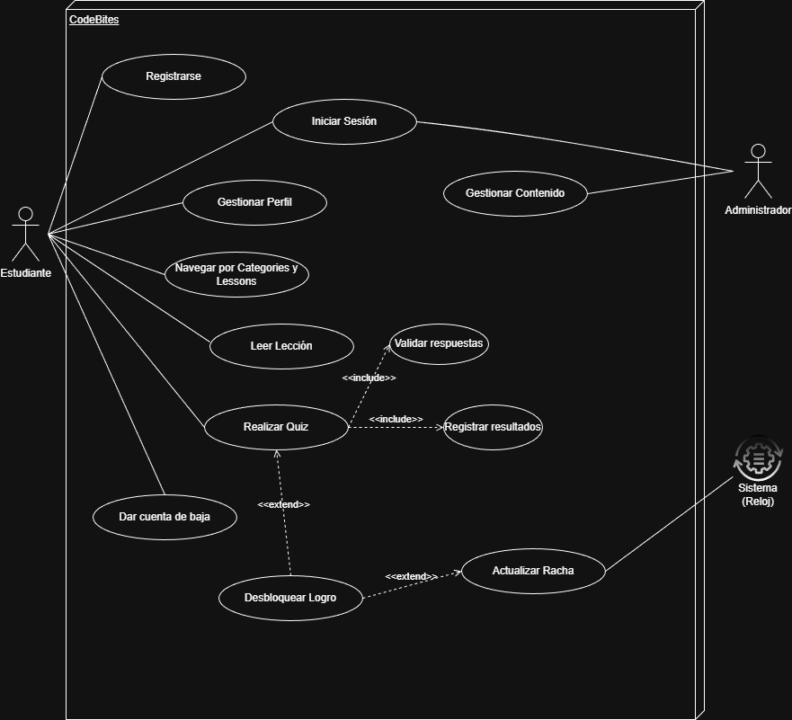
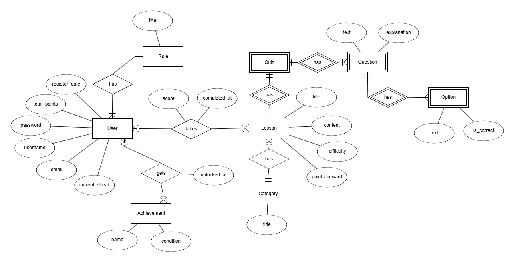
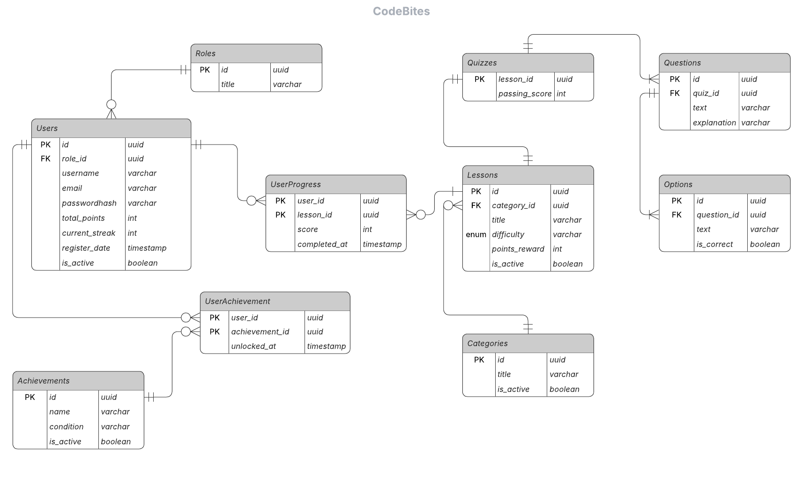

# 1. Introducción

## 1.1 Introducción
Este documento detalla los requerimientos para el desarrollo de **CodeBites**, una plataforma web orientada al micro-aprendizaje de conceptos de desarrollo de software. El proyecto surge como una iniciativa personal para integrar conocimientos de ingeniería de software, arquitectura de sistemas y desarrollo fullstack (.NET + React).

## 1.2 Alcance del Proyecto
El proyecto **CodeBites** consiste en el diseño y desarrollo de una plataforma web multiplataforma orientada al micro-aprendizaje (micro-learning) de conceptos de desarrollo de software. La solución busca optimizar la retención de conocimientos técnicos mediante lecciones atómicas y evaluaciones interactivas, facilitando la formación continua del perfil desarrollador.

### Funcionalidades Incluidas (MVP)
- **Gestión de Contenido Educativo:** Catálogo de lecciones técnicas organizadas por módulos temáticos.
- **Evaluación y Feedback:** Sistema de quizzes con validación automática de respuestas en tiempo real.
- **Gamificación y Progreso:** Registro de avance del usuario y sistema de puntuación acumulativa.
- **Seguridad y Persistencia:** Autenticación mediante JWT y persistencia en base de datos relacional.

### Límites y Exclusiones
- El sistema no funcionará como un IDE; no se realizará compilación ni ejecución de código en el navegador.
- La carga de contenido queda reservada exclusivamente para el rol **Administrador** en esta fase.
- El sistema no emite certificaciones con validez institucional en esta versión inicial.

# 2. Descripción General

## 2.1 Perspectiva del Producto
**CodeBites** se concibe como una aplicación web moderna. Técnicamente, se estructura en un monorepo que contiene:

- **Backend:** Web API desarrollada en ASP.NET Core 8 siguiendo los principios de Clean Architecture.
- **Frontend:** Aplicación SPA construida con React y Next.js, utilizando Tailwind CSS para el diseño.
- **Base de Datos:** Motor relacional PostgreSQL.

## 2.2 Características de los Usuarios

| Tipo de Usuario      | Habilidades                       | Actividades                                                         |
|----------------------|-----------------------------------|----------------------------------------------------------------------|
| Estudiante / Dev     | Conocimientos básicos de IT       | Visualizar lecciones, realizar quizzes y consultar progreso personal |
| Administrador        | Conocimientos técnicos avanzados  | Gestionar lecciones, preguntas y supervisar el sistema               |

# 3. Requerimientos Específicos

## 3.1 Requerimientos Funcionales (RF)

| ID     | Descripción del Requisito                                                                 |
|--------|---------------------------------------------------------------------------------------------|
| RF#01  | El sistema debe permitir el registro y login de usuarios mediante credenciales seguras.    |
| RF#02  | El sistema debe listar categorías y lecciones disponibles según el stack tecnológico.      |
| RF#03  | El sistema debe permitir visualizar el contenido de una lección y desplegar el quiz asociado. |
| RF#04  | El sistema debe validar respuestas de opción múltiple de forma instantánea.                |
| RF#05  | El sistema debe asignar puntos al perfil del usuario tras completar lecciones exitosamente. |
| RF#06  | El sistema debe permitir al Administrador realizar el ABM de categorías, lecciones, preguntas y opciones de respuesta. |
| RF#07  | El sistema debe calcular y actualizar la racha diaria (current_streak) del usuario basándose en su actividad consecutiva. |
| RF#08  | El sistema de desbloquear logros automáticamente cuando el usuario cumpla condiciones especificas. |
| RF#09  | El sistema debe permitir la desactivación lógica (is_active) de usuarios y contenidos, impidiendo su visualización o acceso sin eliminarlos físicamente de la base de datos. |
| RF#10  | El sistema debe permitir al usuario visualizar sus estadísticas personales (puntos acumulados y racha actual). |

## 3.2 Requerimientos No Funcionales (RNF)

| ID     | Descripción del Requisito                                                                 | Clasificación   |
|--------|---------------------------------------------------------------------------------------------|-----------------|
| RNF#01 | La arquitectura backend debe implementar Clean Architecture.                               | Mantenibilidad  |
| RNF#02 | El sistema debe implementar seguridad basada en JWT para la autorización de endpoints.     | Seguridad       |
| RNF#03 | La interfaz debe ser responsive para móviles y escritorio.                                 | Portabilidad    |
| RNF#04 | La validación de quizzes no debe superar los 2 segundos.                                    | Eficiencia      |
| RNF#05 | El sistema debe utilizar identificadores únicos universales (UUID) para todas las entidades principales, asegurando la integridad en entornos distribuidos. | Escalabilidad |
| RNF#06 | : El sistema debe soportar el renderizado de contenido en formato Markdown para las lecciones, permitiendo la visualización correcta de fragmentos de código. | Usabilidad |

# 4. Metodología y Planificación
Se adopta un ciclo de vida incremental con enfoque ágil. El desarrollo se dividirá en módulos (Análisis, Backend Core, Frontend, Integración y Deploy), permitiendo entregas funcionales constantes y documentación técnica actualizada en cada etapa.

## 4.1 Historias de Usuario y Épicas

### 4.1.1 ÉPICA 1: Gestión de Identidad y Acceso (Identity)

**Descripción:**  
Cubre todo el ciclo de vida del usuario y la seguridad de sus datos.

**Requerimientos asociados:**  
RF#01, RF#09, RNF#02, RNF#05

### Historia de Usuario 1.1: Registro de cuenta

**COMO** Usuario visitante  
**QUIERO** crear una cuenta con nombre de usuario, email y contraseña  
**PARA** acceder a las funcionalidades de la plataforma y guardar mi progreso  

**Criterios de Aceptación:**
1. El sistema debe validar que el email sea único y tenga formato correcto.  
2. La contraseña debe almacenarse cifrada en el campo `password_hash`.  
3. Al crear el usuario, se debe generar un `uuid` único y asignar el rol **Estudiante** por defecto.

### Historia de Usuario 1.2: Inicio de Sesión (Login)

**COMO** Usuario registrado  
**QUIERO** autenticarme con mis credenciales  
**PARA** acceder a mi sesión privada de aprendizaje  

**Criterios de Aceptación:**
1. Tras validar las credenciales, el sistema debe devolver un token **JWT** (RNF#02).  
2. El token debe contener el `user_id` y el `role_id` del usuario.

### Historia de Usuario 1.3: Gestión de Perfil y Soft Delete

**COMO** Estudiante  
**QUIERO** ver mis estadísticas y tener la opción de desactivar mi cuenta  
**PARA** monitorear mi avance o retirarme de la plataforma si lo deseo  

**Criterios de Aceptación:**
1. El perfil debe mostrar `total_points` y `current_streak` consultados en tiempo real.  
2. Si el usuario solicita la baja, el sistema debe cambiar `is_active` a `false` (Soft Delete), impidiendo el login pero preservando sus datos históricos.

## Historia de Usuario 1.4: Cierre de Sesión (Logout)

**COMO** Estudiante.  
**QUIERO** cerrar mi sesión de forma segura.  
**PARA** proteger mi cuenta cuando dejo de usar la plataforma.

### Criterio de Aceptación
- El sistema debe invalidar el acceso del cliente.

### 4.1.2 ÉPICA 2: Experiencia de Aprendizaje

**Descripción:**  
Gestión de la navegación y consumo de material educativo.

**Requerimientos asociados:**  
RF#02, RF#03, RNF#07

### Historia de Usuario 2.1: Navegación por Categorías

**COMO** Estudiante  
**QUIERO** listar las categorías tecnológicas disponibles  
**PARA** elegir qué lenguaje o framework deseo estudiar  

**Criterios de Aceptación:**
1. El sistema debe listar solo las **Categories** con `is_active = true`.  
2. Al seleccionar una categoría, se deben listar sus **Lessons** asociadas.

### Historia de Usuario 2.2: Visualización de Lección

**COMO** Estudiante  
**QUIERO** leer el contenido de una lección específica  
**PARA** adquirir los conocimientos teóricos necesarios  

**Criterios de Aceptación:**
1. El contenido de la lección debe renderizarse correctamente desde formato **Markdown** (RNF#07).  
2. Se debe mostrar claramente la `difficulty` y los `points_reward` de la lección.

### 4.1.3 ÉPICA 3: Evaluación y Progreso (Quiz & Progress)

**Descripción:**  
Lógica de validación de conocimientos y persistencia de resultados.

**Requerimientos asociados:**  
RF#04, RF#05, RNF#04, RNF#06

### Historia de Usuario 3.1: Ejecución de Quiz

**COMO** Estudiante  
**QUIERO** responder las preguntas de opción múltiple al finalizar la lección  
**PARA** validar mis conocimientos y completar la unidad  

**Criterios de Aceptación:**
1. El sistema debe cargar las **Questions** y sus **Options** barajadas aleatoriamente.  
2. El tiempo de respuesta de la validación debe ser inferior a **2 segundos** (RNF#04).

### Historia de Usuario 3.2: Registro de Resultados

**COMO** Sistema  
**QUIERO** registrar el puntaje y la fecha de finalización del usuario  
**PARA** mantener el historial de aprendizaje actualizado  

**Criterios de Aceptación:**
1. Al enviar el quiz, se debe crear un registro en **UserProgress** con el `score` obtenido.  
2. El campo `completed_at` debe registrar la marca de tiempo exacta mediante un `timestamp` (RNF#06).

### 4.1.4 ÉPICA 4: Gamificación (Gamification)

**Descripción:**  
Motor de incentivos basado en rachas y medallas.

**Requerimientos asociados:**  
RF#05, RF#07, RF#08

### Historia de Usuario 4.1: Cálculo de Racha Diaria

**COMO** Sistema  
**QUIERO** evaluar la constancia del usuario diariamente  
**PARA** actualizar su racha o resetearla si falta a su estudio  

**Criterios de Aceptación:**
1. Si el usuario completa una lección y la última actividad fue hace menos de **24 hs**, se incrementa `current_streak` en `1`.  
2. Si pasan más de **48 hs** sin actividad registrada en **UserProgress**, la racha vuelve a `0`.

### Historia de Usuario 4.2: Desbloqueo de Logros

**COMO** Estudiante  
**QUIERO** recibir una medalla cuando cumplo un objetivo  
**PARA** sentir reconocimiento por mi esfuerzo  

**Criterios de Aceptación:**
1. Al finalizar un quiz, el sistema debe validar la `condition` de los **Achievements** no obtenidos.  
2. Si se cumple, se inserta el vínculo en **UserAchievement** con el `unlocked_at` actual.

### 4.1.5 ÉPICA 5: Gestión Administrativa (Admin ABM)

**Descripción:**  
Herramientas de control para el administrador de la plataforma.

**Requerimientos asociados:**  
RF#06, RF#09

### Historia de Usuario 5.1: Mantenimiento de Contenido Educativo

**COMO** Administrador  
**QUIERO** crear, editar o desactivar Categorías, Lecciones y Quizzes  
**PARA** mantener el catálogo de cursos actualizado y libre de errores  

**Criterios de Aceptación:**
1. El sistema debe permitir el **ABM completo** de las entidades mediante una interfaz protegida por rol.  
2. Cualquier eliminación debe ser lógica (`is_active = false`) para preservar la integridad de **UserProgress**.

## 4.2 Casos de Uso

### Diagrama de casos de uso

### Módulo 1: Gestión de Identidad

### CU-01: Registro e Inicio de Sesión

**Actores:**  
- Estudiante

**Precondiciones:**  
- Ninguna para el registro.  
- Cuenta activa para el login.

**Flujo Principal:**
1. El usuario ingresa credenciales (`email`, `password`).  
2. El sistema valida la unicidad del email y genera un **UUID** para el nuevo registro.  
3. El sistema aplica un **hash** a la contraseña antes de persistirla en `password_hash`.  
4. Para el login, el sistema valida las credenciales y genera un **token JWT** que incluye `user_id` y `role_id`.

### CU-02: Gestión de Perfil y Soft Delete

**Actores:**  
- Estudiante

**Precondiciones:**  
- Usuario autenticado (JWT válido).

**Flujo Principal:**
1. El estudiante solicita visualizar su perfil.  
2. El sistema recupera `total_points` y `current_streak` de la tabla **Users**.  
3. Si el usuario solicita *“Dar de baja cuenta”*, el sistema marca el campo `is_active` como `false`.

### Módulo 2: Experiencia de Aprendizaje

### CU-03: Navegar y Leer Lecciones

**Actores:**  
- Estudiante

**Flujo Principal:**
1. El estudiante solicita la lista de categorías activas (`is_active = true`).  
2. Al seleccionar una categoría, el sistema muestra las lecciones ordenadas.  
3. El estudiante selecciona una lección y el sistema recupera el contenido en formato **Markdown**.

### Módulo 3: Evaluación y Progreso

### CU-04: Realizar Quiz

**Actores:**  
- Estudiante

**Precondiciones:**  
- Lección visualizada previamente.

**Flujo Principal:**
1. El sistema carga las preguntas y opciones del `quiz_id` asociado.  
2. **Include – Validar respuestas:**  
   - El sistema compara el `option_id` seleccionado con el campo `is_correct` de la tabla **Options**.  
3. **Include – Registrar resultados:**  
   - El sistema crea un registro en **UserProgress** con el `score` obtenido y el `timestamp` actual.

**Postcondiciones:**  
- El sistema dispara los flujos de gamificación.

### Módulo 4: Gamificación

### CU-05: Gestionar Racha y Logros

**Actores:**  
- Sistema (Reloj)

**Flujo Principal:**
1. Tras registrar un progreso, el sistema verifica el tiempo transcurrido desde la última actividad del usuario en **UserProgress**.  
2. Si la actividad es consecutiva, incrementa el `current_streak` en la tabla **Users**.

**Extend – Desbloquear Logro:**
- Si el valor de la racha o el puntaje cumple una `condition` de la tabla **Achievements**, se crea un registro en **UserAchievement**.

### Módulo 5: Gestión Administrativa

### CU-06: Gestionar Contenido

**Actores:**  
- Administrador

**Precondiciones:**  
- Usuario con `role_id` de **Administrador**.

**Flujo Principal:**
1. El administrador accede al panel de gestión.  
2. Puede realizar el **alta, baja o modificación** de cualquier **categoría**, **lección**, **quiz** o **pregunta**.

**Excepción:**  
- No se permite borrar físicamente registros con historial en **UserProgress** para preservar la **integridad referencial**.

# 5. Apendices

## 5.1 DER Conceptual

## 5.2 Modelo lógico/físico

## 5.2 Diccionario de datos

## Módulo 1: Identidad y Acceso
Gestiona la autenticación, perfiles y permisos de los usuarios.

### Tabla: Roles

| Campo | Tipo   | Restricciones | Descripción |
|------|--------|---------------|-------------|
| id   | uuid   | PK            | Identificador único del rol. |
| title| varchar| NOT NULL      | Nombre del rol (ej: `admin`, `student`). |

### Tabla: Users

| Campo | Tipo | Restricciones | Descripción |
|------|------|---------------|-------------|
| id | uuid | PK | Identificador único del usuario. |
| role_id | uuid | FK (Roles.id) | Referencia al rol asignado. |
| username | varchar | NOT NULL, UNIQUE | Nombre de usuario para la plataforma. |
| email | varchar | NOT NULL, UNIQUE | Correo electrónico institucional o personal. |
| password_hash | varchar | NOT NULL | Contraseña cifrada mediante hashing. |
| total_points | int | DEFAULT 0 | Acumulado de puntos por gamificación. |
| current_streak | int | DEFAULT 0 | Contador de días seguidos de estudio. |
| register_date | timestamp | DEFAULT now() | Fecha y hora de creación de la cuenta. |
| is_active | boolean | DEFAULT true | Estado para borrado lógico (Soft Delete). |

## Módulo 2: Contenido Educativo
Jerarquía de lecciones y categorización técnica.

### Tabla: Categories

| Campo | Tipo | Restricciones | Descripción |
|------|------|---------------|-------------|
| id | uuid | PK | ID de la tecnología (ej: `.NET`, `React`). |
| title | varchar | NOT NULL | Nombre de la categoría. |
| is_active | boolean | DEFAULT true | Estado de la categoría. |

### Tabla: Lessons

| Campo | Tipo | Restricciones | Descripción |
|------|------|---------------|-------------|
| id | uuid | PK | Identificador único de la lección. |
| category_id | uuid | FK (Categories.id) | Categoría a la que pertenece. |
| title | varchar | NOT NULL | Título de la unidad temática. |
| difficulty | enum / varchar | NOT NULL | Nivel de dificultad (Beg, Int, Adv). |
| points_reward | int | NOT NULL | Puntos otorgados al completar. |
| is_active | boolean | DEFAULT true | Estado de la lección. |

## Módulo 3: Evaluación (Quizzes)
Estructura jerárquica para la validación del aprendizaje.

### Tabla: Quizzes

| Campo | Tipo | Restricciones | Descripción |
|------|------|---------------|-------------|
| lesson_id | uuid | PK, FK (Lessons.id) | Shared PK. Relación 1:1 con la lección. |
| passing_score | int | NOT NULL | Puntaje mínimo para aprobar la unidad. |

### Tabla: Questions

| Campo | Tipo | Restricciones | Descripción |
|------|------|---------------|-------------|
| id | uuid | PK | Identificador único de la pregunta. |
| quiz_id | uuid | FK (Quizzes.lesson_id) | Quiz al que pertenece la pregunta. |
| text | varchar | NOT NULL | Enunciado de la pregunta. |
| explanation | varchar | — | Explicación técnica de la respuesta. |

### Tabla: Options

| Campo | Tipo | Restricciones | Descripción |
|------|------|---------------|-------------|
| id | uuid | PK | Identificador de la opción de respuesta. |
| question_id | uuid | FK (Questions.id) | Pregunta asociada a la opción. |
| text | varchar | NOT NULL | Texto de la opción. |
| is_correct | boolean | DEFAULT false | Indica si es la respuesta acertada. |

## Módulo 4: Gamificación y Progreso
Registro de la interacción y logros de los usuarios.

### Tabla: UserProgress

| Campo | Tipo | Restricciones | Descripción |
|------|------|---------------|-------------|
| user_id | uuid | PK, FK (Users.id) | Usuario que realiza la lección. |
| lesson_id | uuid | PK, FK (Lessons.id) | Lección cursada. |
| score | double | NOT NULL | Puntaje obtenido en la evaluación. |
| completed_at | timestamp | DEFAULT now() | Fecha y hora exacta de finalización. |

### Tabla: Achievements

| Campo | Tipo | Restricciones | Descripción |
|------|------|---------------|-------------|
| id | uuid | PK | Identificador único del logro/medalla. |
| name | varchar | NOT NULL | Nombre del logro. |
| condition | varchar | NOT NULL | Lógica necesaria para desbloquearlo. |
| is_active | boolean | DEFAULT true | Estado del logro. |

### Tabla: UserAchievement

| Campo | Tipo | Restricciones | Descripción |
|------|------|---------------|-------------|
| user_id | uuid | PK, FK (Users.id) | Usuario que desbloqueó el logro. |
| achievement_id | uuid | PK, FK (Achievements.id) | Logro obtenido. |
| unlocked_at | timestamp | DEFAULT now() | Fecha y hora del desbloqueo. |

## Notas de Diseño

- **Integridad Referencial:** Todas las relaciones entre entidades débiles  
  (`Quiz → Question → Option`) implementan `ON DELETE CASCADE`.
- **Seguridad:** Se utilizan identificadores `uuid` para evitar la enumeración de recursos en la capa de API.
- **Precisión:** Se emplea `timestamp` en todos los registros de eventos para permitir auditorías y cálculos de rachas precisos.
